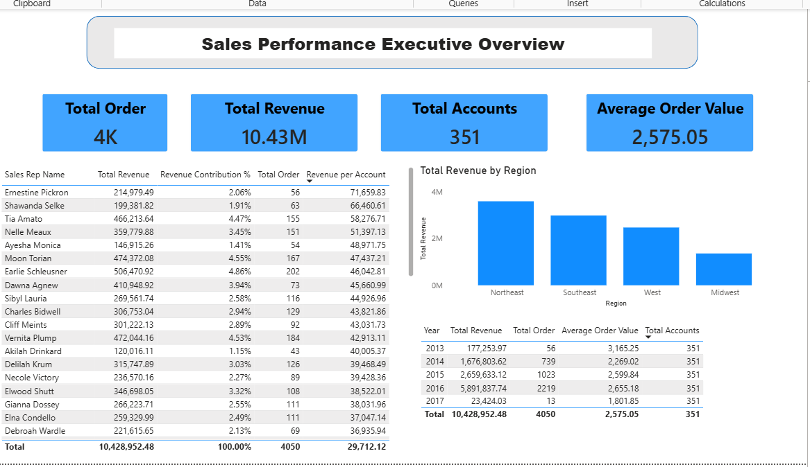
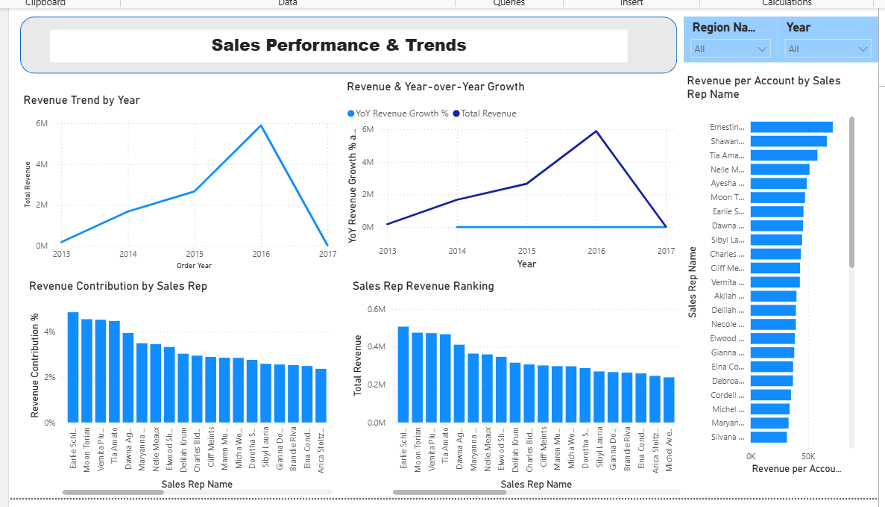
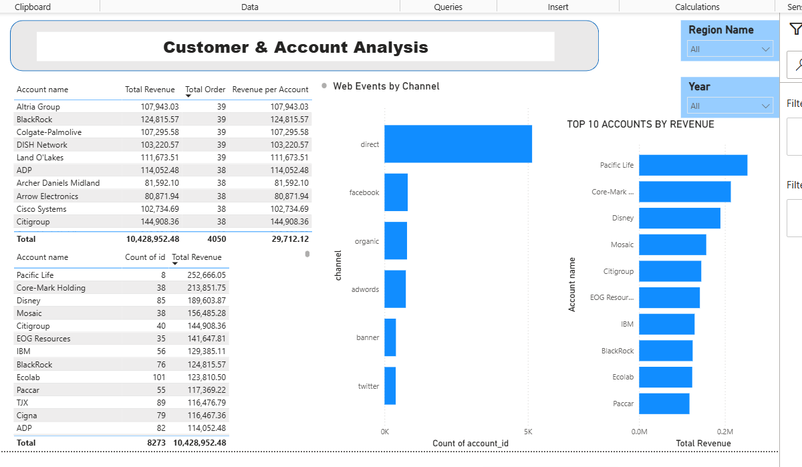
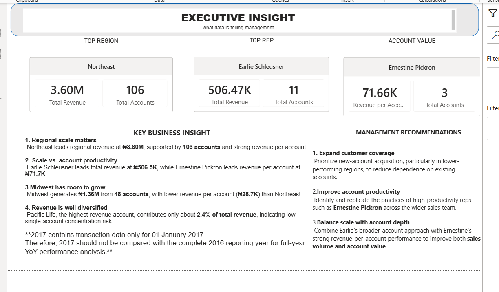

# Sales Performance & Business Insights Dashboard

## Project Overview

An interactive Power BI dashboard developed to analyze sales performance, customer accounts, regional performance, sales representative productivity, and revenue concentration.

The project transforms transactional sales data into actionable business insights using data modeling, DAX, interactive filtering, and business-focused visualization.

## Business Objectives

- Analyze overall revenue performance
- Evaluate sales representative performance
- Compare regional sales performance
- Measure revenue generated per customer account
- Identify customer concentration and account dependency
- Compare sales scale against account productivity
- Identify opportunities for customer acquisition and revenue growth
- Validate data quality before drawing business conclusions

## Tools & Technologies

- Power BI
- DAX
- Power Query
- Excel
- Data Modeling
- Data Visualization
- Business Intelligence
- Sales Analytics

## Dashboard Pages

### Page 1 — Executive Overview

Provides a high-level view of overall sales performance and key business KPIs.

### Page 2 — Sales Performance

Analyzes sales performance across time and other business dimensions.

### Page 3 — Customer & Account Analysis

Examines customer accounts, revenue contribution, account performance, and sales activity.

### Page 4 — Executive Insights

Summarizes the major findings from the analysis and translates them into management recommendations.

## Key Business Insights

- Northeast generated the highest regional revenue at approximately ₦3.60M.
- Earlie Schleusner generated the highest total revenue at approximately ₦506.5K.
- Ernestine Pickron generated the highest revenue per account at approximately ₦71.7K.
- The analysis highlights the difference between sales scale and account productivity.
- Pacific Life contributed approximately 2.4% of total revenue, indicating relatively low single-account concentration risk.
- Northeast's performance was supported by broad account coverage and strong account productivity.
- Midwest trailed Northeast in both account coverage and revenue per account.

## Data Quality Finding

The analysis identified that 2017 contained transaction data only for 01 January 2017.

Therefore, 2017 should not be compared with the complete 2016 reporting year for full-year YoY performance analysis.

This demonstrates the importance of validating data coverage before interpreting trends.

## Management Recommendations

1. Expand customer coverage, particularly in lower-performing regions.
2. Improve account productivity by identifying and replicating high-performing sales practices.
3. Balance account expansion with deeper revenue generation from existing customers.
4. Monitor data completeness before making year-over-year performance decisions.

## Dashboard Preview

### Page 1 — Executive Overview

### Page 2 — Sales Performance

### Page 3 — Customer & Account Analysis

### Page 4 — Executive Insights

## Author

Amaja Onos
